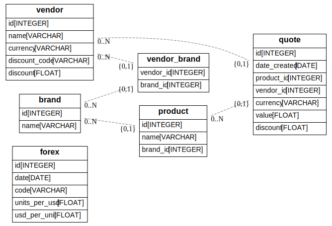

# Buyer

A few variations on a basic online purchasing support tool.

Meant to help learn about the strengths (and weaknesses) of each language used.

## Target core features

- commandline interface
- organization and persistence (sqlite and alternatively, postgres) of all buying data
	- inventory of purchased items
- repl for buying support
- webscraping of vendor's prices
- report generation (xlsx, html, pdf..)
    - quote comparison
    - shipping costs attribution based on destination (from, to)
    - discount codes
    - sales patterns recommendation
    - budget mgmt

## Develop in Different Languages

1. [python](buyer-python)
2. [swift](buyer-swift)
3. c++
4. rust
5. go

## Current Model

